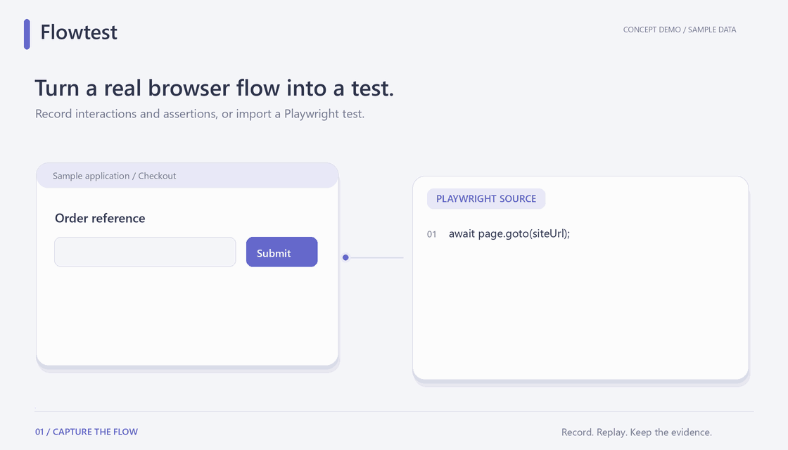

# Flowtest — Backend and browser runtimes

**Turn browser workflows into repeatable tests, with assertions and Trace evidence behind every result.**

[English](README.en.md) · [简体中文](README.md) · [MIT](LICENSE)

[Static image](docs/media/flowtest-en-poster.png) · [Animation source](docs/media/README.md)

Flowtest is a self-hosted Playwright workflow-testing platform. Record browser actions and assertions with the official codegen / Inspector, or import TypeScript tests written by you or an AI. No paid model account is required.

## Why Flowtest

- **Repeat the original context.** Historical reruns copy the original source versions and environment snapshot into a new run. Later edits do not rewrite past runs.
- **Keep failures visible.** A retry that passes remains flaky; its first failure is retained. An interaction without assertions remains unverified.
- **Inspect the evidence.** Follow scenario, version, test and attempt identities to expectations, actual values, logs, screenshots and private Playwright Trace artifacts.

## Start here

The complete product uses two repositories: [FastAPI backend + runtimes](https://github.com/ShiqinGuo/e2e-test-svc) and [React workbench](https://github.com/ShiqinGuo/e2e-test-fronted). This repository contains the **backend and browser runtimes**. Its companion is [e2e-test-fronted](https://github.com/ShiqinGuo/e2e-test-fronted).

1. Prepare Python 3.12+, uv, Node.js 24+, npm and a Docker Linux engine for the backend.
2. Follow the [backend setup commands](https://github.com/ShiqinGuo/e2e-test-svc#quick-start): bootstrap local configuration, start PostgreSQL, run migrations, build both Playwright images, and launch one API worker on port 4100.
3. Start the workbench with `npm ci` and `npm run dev`; open `http://127.0.0.1:5173` and register your own account.
4. Create a project and environment pointing to a website reachable from the runner, then create a group and scenario. Record or import a test, save a version, run it, and inspect assertions and Trace.

Try the [local order fixture](https://github.com/ShiqinGuo/e2e-test-svc/blob/main/docs/development.md#验证) if you do not have a target website. Flowtest does not deploy the application under test.

## Architecture

The FastAPI service owns authentication, project authorization, immutable versions and run state. PostgreSQL stores platform data; private artifacts live in the API host data directory. A trusted Node controller starts Docker runner and recorder containers. Imported tests do not execute inside the API process. [Source map](docs/architecture.md).

## Scope and verification

Supports single-owner projects, containerized recording and execution, individual scenarios and test groups. Team membership, distributed execution and direct multi-database assertions are not included.

See the [backend acceptance record](https://github.com/ShiqinGuo/e2e-test-svc/blob/main/docs/acceptance.md) and [workbench acceptance index](https://github.com/ShiqinGuo/e2e-test-fronted/blob/main/docs/redesign-verification.md) for the tested flows and results.

## Development and license

[Detailed setup and checks](docs/development.md) · [Report an issue](https://github.com/ShiqinGuo/e2e-test-svc/issues)

Flowtest's original code is [MIT licensed](LICENSE). Third-party components retain their own licenses and attribution; see the [UI provenance](https://github.com/ShiqinGuo/e2e-test-fronted/blob/main/docs/third-party-ui.md).
