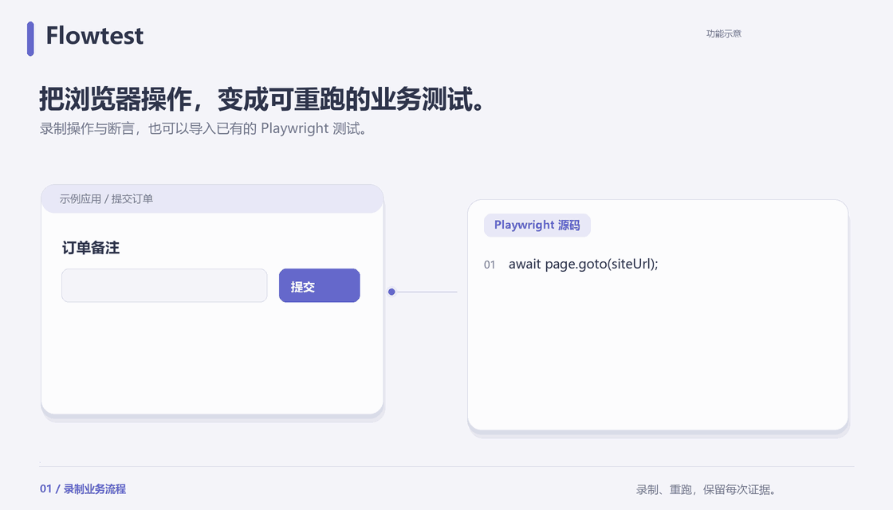

# Flowtest

**把浏览器操作变成可重跑的业务测试，让每次结果都有源码、断言和 Trace 可查。**

[简体中文](README.md) · [English](README.en.md)

[](LICENSE)
[](docs/runner.md)
[](docs/self-hosting.md)

[开始使用](#quick-start) · [Web 工作台](https://github.com/ShiqinGuo/e2e-test-fronted) · [技术架构](#architecture) · [验证范围](#verification) · [反馈问题](https://github.com/ShiqinGuo/e2e-test-svc/issues)

适合需要反复验证 Web 业务流程的开发者和测试人员：录制一次浏览器操作，或导入已有 Playwright Test，保存场景版本，再针对指定环境执行并追查失败。无需付费模型账户，也可以导入人或 AI 编写的测试源码。



[静态图](docs/media/flowtest-zh-CN-poster.png) · [动画源码](docs/media/README.md)

## 为什么需要 Flowtest

- **重跑有明确上下文。** 历史重跑沿用当时的源码版本和环境快照；今天改了场景或环境，也不会改写昨天的记录。
- **通过与验证分开看。** 只完成点击不等于验证业务；没有真实断言时保留 `unverified`，重试通过仍标记 `flaky`。
- **从结论追到证据。** 沿场景、固定版本、测试和执行尝试查看期望/实际值、日志、截图和私有 Trace；首次失败不会被覆盖。

## 两个仓库，一个产品

本仓库提供后端及浏览器运行时，完整交互体验需要前端工作台。Flowtest 连接已经可访问的被测网站，不负责部署你的业务应用。

| 仓库 | 负责什么 |
| --- | --- |
| [e2e-test-svc](https://github.com/ShiqinGuo/e2e-test-svc) | FastAPI 控制服务、PostgreSQL、Playwright 执行与录制容器 |
| [e2e-test-fronted](https://github.com/ShiqinGuo/e2e-test-fronted) | React Web 工作台：编辑场景、管理环境、查看运行和证据 |

<a id="quick-start"></a>
## 开始使用

### 1. 启动后端与浏览器运行时

需要 **Python 3.12+、uv、Node.js 24+、npm、Docker Linux engine 和 Git**。Windows 使用 Docker Desktop 的 Linux containers。

```sh
git clone https://github.com/ShiqinGuo/e2e-test-svc.git
cd e2e-test-svc
uv sync --frozen
npm ci
uv run python scripts/bootstrap.py
docker compose up -d --wait postgres
uv run python -m app.migrations
docker build -f runtime/runner/Dockerfile -t e2e-runner:1.63.0 .
docker build -f runtime/recorder/Dockerfile -t e2e-recorder:1.63.0 .
uv run uvicorn app.main:app --host 127.0.0.1 --port 4100 --no-access-log
```

保持终端运行，可访问 [健康检查](http://localhost:4100/api/health)。`bootstrap.py` 生成本地配置，数据库端口为 `55432`。使用单个 Uvicorn worker，Windows 不加 `--reload`。

### 2. 启动 Web 工作台

另开终端，在存放项目的目录执行：

```sh
git clone https://github.com/ShiqinGuo/e2e-test-fronted.git
cd e2e-test-fronted
npm ci
npm run dev
```

打开 [http://127.0.0.1:5173](http://127.0.0.1:5173)，注册自己的账号。前端代理 `/api` HTTP 与 WebSocket 到 `localhost:4100`。

### 3. 完成第一条业务测试

创建项目与环境 → 填写浏览器容器可访问的网站地址 → 创建测试组和场景 → 录制操作与断言，或导入 Playwright Test → 保存版本并运行 → 查看断言和 Trace。

还没有被测网站？启动 [内置订单示例](docs/development.md#验证)，完成一次本地读写。Docker Desktop 中容器访问本机服务使用 `host.docker.internal`，Linux 需配置实际可达地址。

## 核心能力

| 任务 | Flowtest 如何支持 |
| --- | --- |
| 创建测试 | 官方 Playwright codegen / Inspector 远程录制，或导入 TypeScript 测试 |
| 维护流程 | 新增不可变版本、复用版本内模块、代码编辑与检查点辅助 |
| 准备环境 | 命名网站与 API、角色会话、变量、API setup / cleanup 与动态数据传递 |
| 执行与重跑 | 单场景或测试组、容器内运行、固化源码和环境、取消与历史快照重跑 |
| 定位问题 | 逐尝试事件、断言、日志、截图和官方 Trace Viewer，工件按项目授权 |
| 接入脚本 | CLI 仅在 passed、verified 且无 flaky 时返回 0；见 [开发与运行指南](docs/development.md) |

<a id="architecture"></a>
## 技术架构


FastAPI 拥有账号、项目权限、版本和运行记录；PostgreSQL 保存平台状态，工件保存在宿主的私有数据目录。受信任的 Node 控制器负责启动独立 Docker 运行器和录制器，导入的场景代码不会在 API 进程内执行。组件与源码对应见 [架构说明](docs/architecture.md)。

<a id="verification"></a>
## 当前范围与验证

支持项目单 owner、容器执行与录制、单场景和分组测试。团队协作、分布式队列和多数据库直连尚未提供。

本地验收覆盖 PostgreSQL、Docker Chromium、Web 录制、快照重跑及运行证据，详细结果见 [后端验收](docs/acceptance.md) 和 [前端验收](https://github.com/ShiqinGuo/e2e-test-fronted/blob/main/docs/redesign-verification.md)。

## 深入文档与贡献

[完整开发指南](docs/development.md) · [API 契约](docs/api-contract.md) · [运行器](docs/runner.md) · [录制器](docs/recorder.md) · [自托管](docs/self-hosting.md)

欢迎在 Issues 提交复现步骤、预期/实际结果和脱敏证据。保留首次失败与重试记录；测试和验收命令见开发指南。

## License

Flowtest 自有代码采用 [MIT](LICENSE)。Playwright、FastAPI Users、noVNC 等依赖保留各自许可；前端复用组件的来源和许可见 [第三方 UI 说明](https://github.com/ShiqinGuo/e2e-test-fronted/blob/main/docs/third-party-ui.md)。
